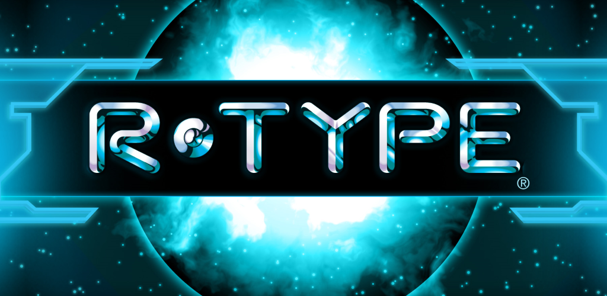

# Projet R-Type - Rapport de Projet



## Introduction

Ce document rapporte notre projet de troisième année à Epitech, où nous avons entrepris de développer un jeu R-Type. Dans le cadre de ce projet, nous avons conçu notre propre moteur de jeu et implémenté un réseau pour permettre au jeu d'être joué en ligne via un serveur que nous avons créé. Ce rapport présente une vue d'ensemble du projet, y compris les objectifs, les étapes de développement, les défis rencontrés et les réalisations.

## Architecture du Projet

Notre projet R-Type repose sur une architecture logicielle bien définie comprenant les composants suivants :

1. **Moteur de Jeu Personnalisé :** Nous avons développé notre propre moteur de jeu pour alimenter le jeu R-Type. Il gère les graphismes, la physique, les entrées et la gestion des ressources.

2. **Jeu R-Type :** Le jeu lui-même est construit sur notre moteur de jeu personnalisé. Il comprend des niveaux, des ennemis, des joueurs et des fonctionnalités de gameplay.

3. **Réseau Multi-joueurs :** Nous avons mis en place un réseau pour permettre aux joueurs de jouer en ligne. Il gère la synchronisation des données de jeu entre les clients et le serveur.

4. **Gestion des Ressources :** Un système de gestion des ressources a été implémenté pour charger efficacement des images, des sons et d'autres actifs dans le jeu.

## Jeu

Pour plus de détail sur le jeu cliquer ci dessous
[R-Type](game.md)

## Game Engine

Pour plus de détail sur le game engine cliquer ci dessous
[Game Engine](./GameEngine/GameEngine.md)

## Build

1. Create a build directory at the root:
    ```bash
    mkdir build
    cd build

2. Compile in this directory:
    ```bash
    cmake ..
    make

3. Go to the bin directory created by the compilation:
    ```bash
    cd bin

4. Execute the binary in the bin directory:
    ```bash
    ./project

## Conclusion

Ce projet de troisième année à Epitech nous a offert l'opportunité de développer un jeu R-Type complet, de créer notre propre moteur de jeu, et d'implémenter un réseau pour le rendre jouable en ligne. Cette expérience nous a permis de mettre en pratique nos compétences en programmation, en conception de jeux et en gestion de projet. Nous sommes fiers des réalisations de ce projet et de l'expérience enrichissante qu'il nous a offerte.

## Contributor

- abdelkader.mazouz@peitech.eu
- vincent.ballandi@epitech.eu
- younes1.bahri@epitech.eu
- swann.lagoute@epitech.eu
- simon.vermeulen@epitech.eu